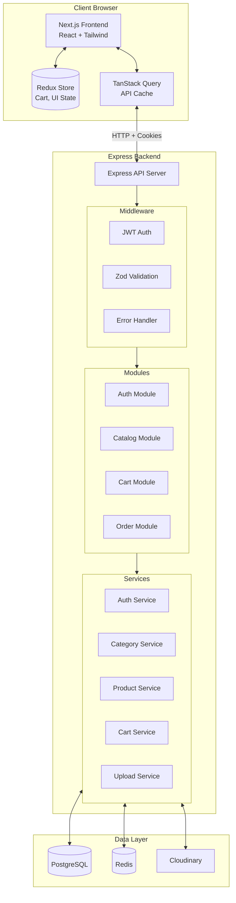
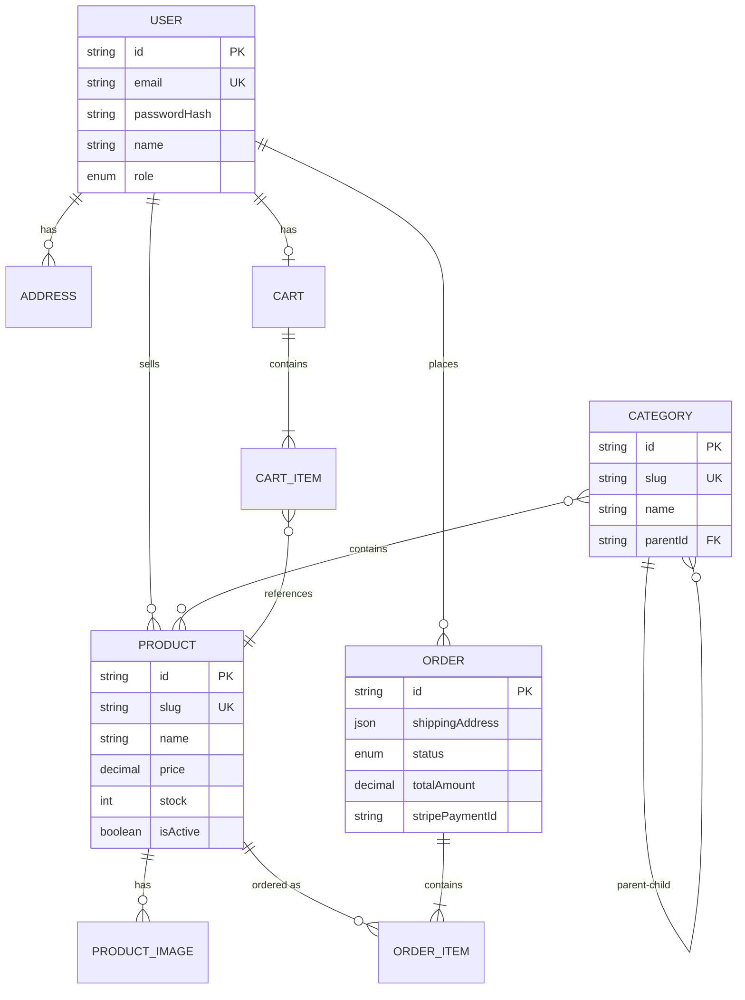
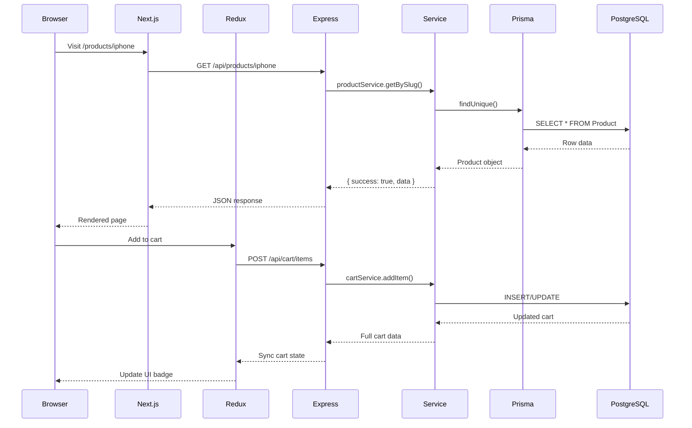
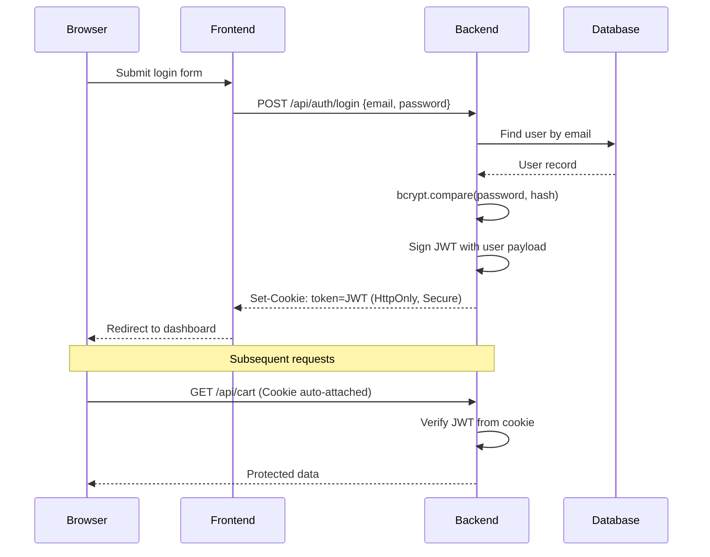
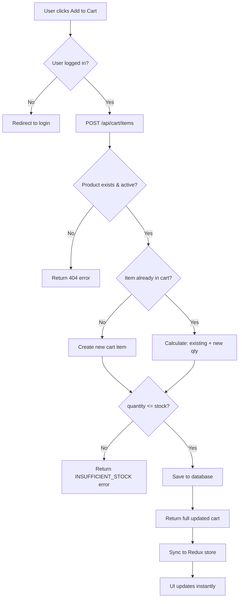
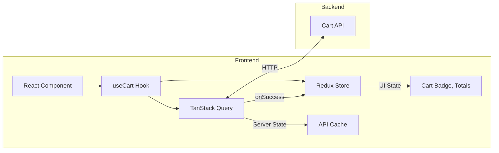
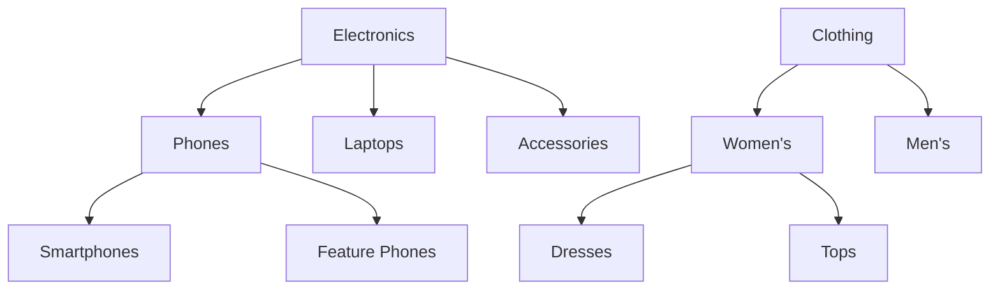

# Auraya E-Commerce Platform

Auraya is a modern, full-stack e-commerce application built as a modular monolith with separate frontend and backend services.

---

## Tech Stack

| Layer | Technology |
|-------|------------|
| **Frontend** | Next.js 16 (App Router), React 19, TypeScript |
| **Styling** | Tailwind CSS v4, Shadcn/UI |
| **State** | Redux Toolkit (cart, UI), TanStack Query (API) |
| **Backend** | Node.js, Express.js, TypeScript |
| **Database** | PostgreSQL with Prisma ORM |
| **Cache/Queue** | Redis (BullMQ for background jobs) |
| **Auth** | JWT with HttpOnly cookies |
| **Storage** | Cloudinary (images) |

---

## Architecture Diagram



---

## Data Model



---

## Request Flow



---

## Module Structure

```
auraya/
├── backend/
│   ├── src/
│   │   ├── config/          # DB, Redis, Cloudinary configs
│   │   ├── controllers/     # HTTP request handlers
│   │   ├── middlewares/     # Auth, validation, error handling
│   │   ├── routes/          # API endpoint definitions
│   │   ├── services/        # Business logic layer
│   │   ├── validators/      # Zod validation schemas
│   │   └── utils/           # AppError, async wrapper, helpers
│   └── prisma/
│       ├── schema.prisma    # Database schema
│       └── seed.ts          # Sample data seeder
│
├── frontend/
│   ├── src/
│   │   ├── app/             # Next.js App Router pages
│   │   ├── components/      # React UI components
│   │   ├── hooks/           # Custom hooks (useAuth, useCart)
│   │   ├── lib/             # API client, Redux store
│   │   ├── providers/       # Context providers
│   │   └── types/           # TypeScript definitions
│   └── public/              # Static assets
│
├── docker-compose.yml       # Development environment
└── docker-compose.prod.yml  # Production deployment
```

---

## Core Features (Detailed)

### 1. JWT Authentication with HttpOnly Cookies

**Problem Solved:** Secure user authentication that prevents XSS attacks from stealing tokens.

**How It Works:**



**Implementation Details:**

| Component | File | Responsibility |
|-----------|------|----------------|
| Password Hashing | `utils/password.ts` | bcrypt with salt rounds |
| Token Signing | `utils/jwt.ts` | Signs payload with secret, 7-day expiry |
| Cookie Setting | `auth.controller.ts` | HttpOnly, Secure, SameSite=Lax |
| Token Verification | `middlewares/auth.ts` | Extracts and verifies on each request |

**Security Features:**
- **HttpOnly cookies**: JavaScript cannot access the token (prevents XSS theft)
- **Password never stored**: Only bcrypt hash saved to database
- **Role embedded in token**: `{ userId, email, role }` for authorization checks
- **Automatic exclusion**: `passwordHash` field stripped from all API responses

```typescript
// auth.service.ts - Password is never returned
const excludePassword = (user: User): SafeUser => {
  const { passwordHash: _, ...safeUser } = user;
  return safeUser;
};
```

---

### 2. Server-Side Shopping Cart with Stock Validation

**Problem Solved:** Persistent cart that survives browser refresh/logout, with real-time inventory checks to prevent overselling.

**How It Works:**



**Key Design Decisions:**

1. **Get-or-Create Pattern**: Cart is auto-created on first access
```typescript
// cart.service.ts
async getCart(userId: string) {
  let cart = await prisma.cart.findUnique({ where: { userId } });
  if (!cart) {
    cart = await prisma.cart.create({ data: { userId } });
  }
  return cart;
}
```

2. **Stock Validation on Every Mutation**: Prevents race conditions
```typescript
// Validates before add AND before update
if (newQuantity > product.stock) {
  throw AppError.badRequest(
    `Only ${product.stock} items available in stock`,
    'INSUFFICIENT_STOCK'
  );
}
```

3. **Full Cart Return**: Every mutation returns the complete cart state
```typescript
// After add/update/remove, always return full cart
return this.getCart(userId);
```

**Cart Item Data Structure:**
```typescript
{
  id: "clx...",
  quantity: 2,
  product: {
    id: "clx...",
    name: "iPhone 15 Pro",
    slug: "iphone-15-pro",
    price: 999.00,
    stock: 50,
    images: [{ url: "https://..." }]
  }
}
```

---

### 3. Real-Time Cart State Synchronization (TanStack Query + Redux)

**Problem Solved:** Keep server state and UI state in perfect sync without manual refetching.

**Architecture:**



**How It Works:**

```typescript
// useCart.ts - The synchronization pattern
const syncCartToRedux = (cart: Cart) => {
  dispatch(setCartItems(cart.items));           // Update Redux
  queryClient.setQueryData(CART_QUERY_KEY, cart); // Update Query cache
};

const addItemMutation = useMutation({
  mutationFn: (input) => api.post("/cart/items", input),
  onSuccess: (data) => syncCartToRedux(data.cart), // Sync on success
});
```

**Why Both TanStack Query AND Redux?**

| Concern | TanStack Query | Redux |
|---------|----------------|-------|
| Server state caching | Yes | No |
| Background refetching | Yes | No |
| Optimistic updates | Yes | No |
| Global UI state | No | Yes |
| Cart badge in header | No | Yes (selector) |
| Persist across pages | Partial | Yes |

**Redux Selectors for UI:**
```typescript
// cartSlice.ts
export const selectCartItemCount = (state) =>
  state.cart.items.reduce((sum, item) => sum + item.quantity, 0);

export const selectCartTotal = (state) =>
  state.cart.items.reduce(
    (sum, item) => sum + Number(item.product.price) * item.quantity,
    0
  );
```

---

### 4. Product Catalog with Advanced Filtering

**Problem Solved:** Scalable product browsing with search, category filtering, price ranges, and pagination.

**Query Parameters:**

| Parameter | Type | Description |
|-----------|------|-------------|
| `page` | number | Page number (default: 1) |
| `limit` | number | Items per page (default: 20, max: 100) |
| `categorySlug` | string | Filter by category |
| `search` | string | Search in name and description |
| `minPrice` | number | Minimum price filter |
| `maxPrice` | number | Maximum price filter |
| `sellerId` | string | Filter by seller |
| `sortBy` | string | Sort field (price, createdAt, name) |
| `sortOrder` | string | asc or desc |

**Implementation:**

```typescript
// product.service.ts - Dynamic query building
const where: Prisma.ProductWhereInput = {
  deletedAt: null,  // Always exclude soft-deleted
};

if (categorySlug) {
  where.categories = { some: { slug: categorySlug } };
}

if (search) {
  where.OR = [
    { name: { contains: search, mode: 'insensitive' } },
    { description: { contains: search, mode: 'insensitive' } },
  ];
}

if (minPrice !== undefined) {
  where.price = { ...where.price, gte: minPrice };
}
```

**Soft Delete Pattern:**
```typescript
// Delete doesn't remove data - sets deletedAt timestamp
async delete(id: string) {
  await prisma.product.update({
    where: { id },
    data: { deletedAt: new Date() },
  });
}

// All queries filter out deleted products
where: { deletedAt: null }
```

**Response Format:**
```json
{
  "success": true,
  "data": {
    "products": [...],
    "pagination": {
      "page": 1,
      "limit": 20,
      "total": 156,
      "totalPages": 8
    }
  }
}
```

---

### 5. Hierarchical Category System

**Problem Solved:** Organize products into nested categories (Electronics > Phones > Smartphones).

**Data Model:**



**Self-Referential Relationship:**
```prisma
model Category {
  id       String     @id @default(cuid())
  name     String
  slug     String     @unique
  parentId String?
  parent   Category?  @relation("CategoryHierarchy", fields: [parentId], references: [id])
  children Category[] @relation("CategoryHierarchy")
}
```

**Tree Building Algorithm:**
```typescript
// category.service.ts - Recursive tree construction
const buildCategoryTree = (
  categories: Category[],
  parentId: string | null = null
): CategoryWithChildren[] => {
  const result: CategoryWithChildren[] = [];

  for (const category of categories) {
    if (category.parentId === parentId) {
      const children = buildCategoryTree(categories, category.id);
      result.push({
        ...category,
        ...(children.length > 0 && { children }),
      });
    }
  }
  return result;
};
```

**Circular Reference Prevention:**
```typescript
// Prevents: A -> B -> C -> A (infinite loop)
let currentParent = parent;
while (currentParent.parentId) {
  if (currentParent.parentId === id) {
    throw AppError.badRequest(
      'Circular parent reference detected',
      'CIRCULAR_REFERENCE'
    );
  }
  currentParent = await prisma.category.findUnique({
    where: { id: currentParent.parentId },
  });
}
```

**API Response (Tree Mode):**
```json
{
  "categories": [
    {
      "id": "clx...",
      "name": "Electronics",
      "slug": "electronics",
      "children": [
        {
          "id": "clx...",
          "name": "Phones",
          "slug": "phones",
          "children": [...]
        }
      ]
    }
  ]
}
```

**Deletion Safety:**
```typescript
// Cannot delete if has children or products
if (existing.children.length > 0) {
  throw AppError.badRequest('Cannot delete category with child categories');
}
if (existing.products.length > 0) {
  throw AppError.badRequest('Cannot delete category with products');
}
```

---

## API Endpoints

### Auth
| Method | Endpoint | Description |
|--------|----------|-------------|
| POST | `/api/auth/register` | Create new account |
| POST | `/api/auth/login` | Login and set cookie |
| POST | `/api/auth/logout` | Clear auth cookie |
| GET | `/api/auth/me` | Get current user |

### Categories
| Method | Endpoint | Description |
|--------|----------|-------------|
| GET | `/api/categories` | List all categories |
| GET | `/api/categories/:slug` | Get category by slug |
| POST | `/api/categories` | Create category (Admin) |
| PATCH | `/api/categories/:id` | Update category (Admin) |
| DELETE | `/api/categories/:id` | Delete category (Admin) |

### Products
| Method | Endpoint | Description |
|--------|----------|-------------|
| GET | `/api/products` | List products (with filters) |
| GET | `/api/products/:slug` | Get product by slug |
| POST | `/api/products` | Create product (Seller) |
| PATCH | `/api/products/:id` | Update product (Seller) |
| DELETE | `/api/products/:id` | Soft delete product (Seller) |

### Cart
| Method | Endpoint | Description |
|--------|----------|-------------|
| GET | `/api/cart` | Get user's cart |
| POST | `/api/cart/items` | Add item to cart |
| PATCH | `/api/cart/items/:itemId` | Update item quantity |
| DELETE | `/api/cart/items/:itemId` | Remove item from cart |
| DELETE | `/api/cart` | Clear entire cart |

---

## Test Credentials

| Role | Email | Password |
|------|-------|----------|
| Admin | admin@auraya.com | admin123 |
| Seller | seller@auraya.com | seller123 |

---

## Development

```bash
# Start database and Redis
docker-compose up -d

# Backend
cd backend
npm install
npm run db:push
npm run db:seed
npm run dev

# Frontend (new terminal)
cd frontend
npm install
npm run dev
```

Visit `http://localhost:3000` for the frontend and `http://localhost:3001` for the API.
